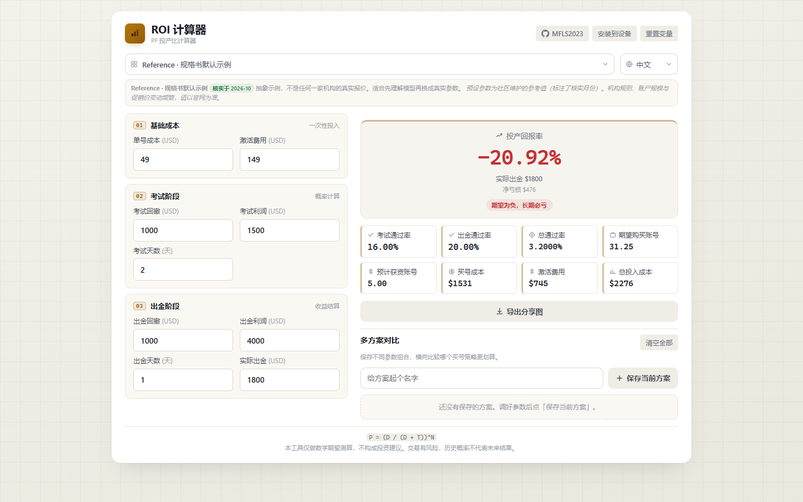
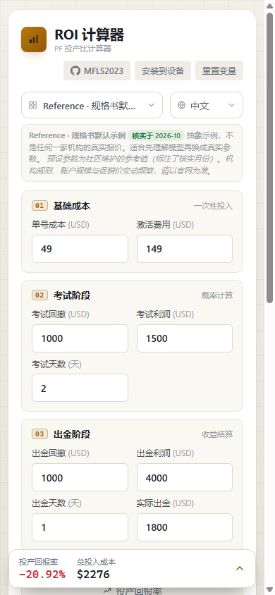
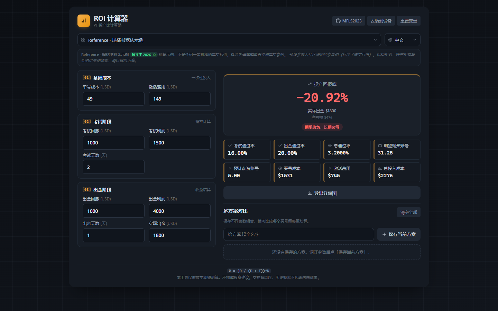
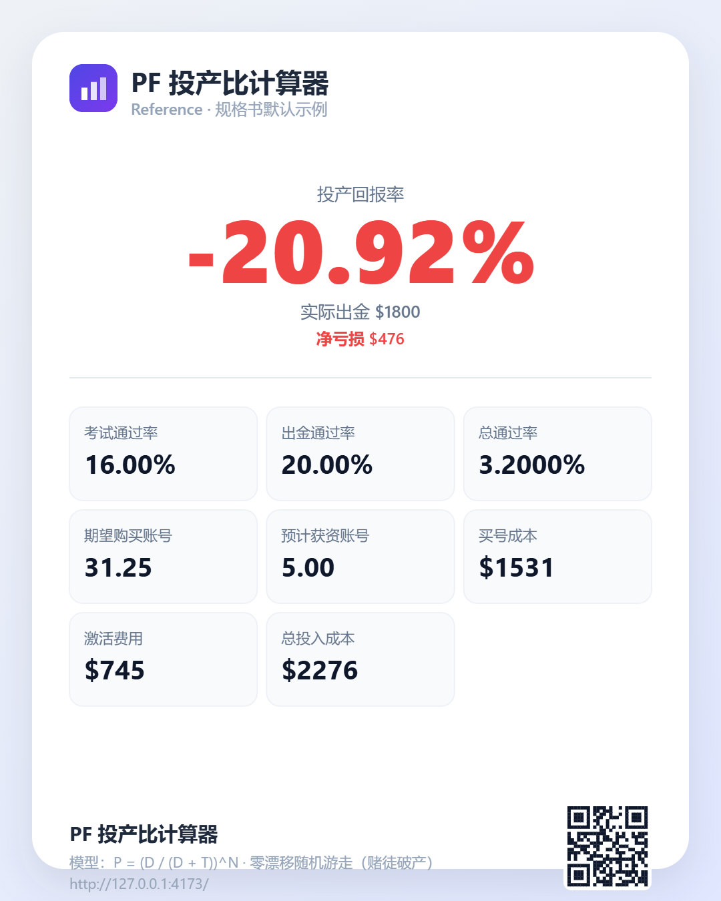

# PF 投产比计算器 · Prop Firm ROI Calculator

[English](./README.md) · **简体中文**

> 在买下一个考试号之前先算清楚：我到底需要买多少个？总共花多少钱？出金之后投产比是正还是负？

<!-- 徽章 -->


---

## 这是什么

自营交易公司（Prop Firm，如 Apex、Topstep、FTMO、FundedNext）卖给你一个**考试账号**：
你付钱，在最大回撤限制内打到利润目标就算通过，拿到获资账号；之后还要再过一道坎才能申请出金。

每一步都有爆仓概率。所以真正该问的不是「我能不能过」，而是：

- 平均要买多少个考试号，才能换来**一次**成功出金？
- 算上激活费，我总共要投多少钱？
- 按实际到手的出金算，我的**投产比是正还是负**？

这个工具把这三个问题一屏算清，**完全离线**，不联网、不注册、不上报。

它是一个**纯前端静态应用**：没有后端、没有账号、没有埋点、运行时零网络请求。
全项目只有 **1 个**运行时依赖。

## 界面截图

| 桌面端 | 手机端 | 深色模式 |
| --- | --- | --- |
|  |  |  |

导出的分享图（完全由设备端 Canvas 绘制，含二维码）：



---

## 快速开始

### 1. 直接用浏览器打开（无需安装）

打开托管版本，或者直接双击 `standalone/PF-ROI-Calculator.standalone.html`——
这是一个零依赖的单文件 HTML，放在 U 盘里、断网状态下都能永久使用。

### 2. 装成 App（推荐）

打开网页版后安装：

- **安卓 / Chrome / Edge** —— 页面右上角会出现「安装到设备」按钮，或用浏览器的「安装应用」菜单
- **iOS Safari** —— 点「分享」→「添加到主屏幕」
- **桌面版 Chrome / Edge** —— 地址栏右侧的安装图标

安装后它会以独立窗口启动，**完全不需要网络**。

### 3. 桌面软件

到 [Releases](../../releases) 页面下载安装包：Windows 是 `.msi`/`.exe`，
macOS 是 `.dmg`，Linux 是 `.deb`/`.rpm`/`.AppImage`。
这些由 CI 自动构建，**你本地不需要装 Node 或 Rust**。

### 4. 从源码运行

```bash
git clone https://github.com/MFLS2023/pf-roi-calculator.git
cd pf-roi-calculator
npm install
npm run dev        # http://127.0.0.1:5173
```

---

## 数学模型

### 单阶段通过率

从起始权益出发，**零漂移随机游走**（经典赌徒破产问题）给出的结论是：
在触发回撤 `D` 之前先摸到利润目标 `T` 的概率为

```
P_single = D / (D + T)
```

连续 `N` 天复合：

```
P = (D / (D + T)) ^ N
```

- **考试通过率** —— `P_exam = (考试回撤 / (考试回撤 + 考试利润)) ^ 考试天数`
- **出金通过率** —— `P_payout = (出金回撤 / (出金回撤 + 出金利润)) ^ 出金天数`
- **总通过率** —— `P_total = P_exam × P_payout`

### 账号量与成本

要拿到 1 次成功，平均需要尝试 `1 / P` 次（几何分布的期望）：

```
期望购买账号 N_buy    = 1 / P_total
预计获资账号 N_funded = N_buy × P_exam = 1 / P_payout

买号成本     = N_buy    × 单号成本
激活费用     = N_funded × 激活费用
总投入成本   = 买号成本 + 激活费用
```

### 回报率

```
ROI = (实际出金 − 总投入成本) / 总投入成本 × 100%
```

### 默认示例的完整推导

| 输入项 | 数值 |
| --- | --- |
| 单号成本 | $49 |
| 激活费用 | $149 |
| 考试回撤 / 利润 / 天数 | $1,000 / $1,500 / 2 |
| 出金回撤 / 利润 / 天数 | $1,000 / $4,000 / 1 |
| 实际出金 | $1,800 |

| 结果 | 数值 |
| --- | --- |
| 考试通过率 | `(1000/2500)² = 16.00%` |
| 出金通过率 | `(1000/5000)¹ = 20.00%` |
| 总通过率 | `3.2000%` |
| 期望购买账号 | `1 / 0.032 = 31.25` |
| 预计获资账号 | `1 / 0.20 = 5.00` |
| 买号成本 | `31.25 × $49 = $1531` |
| 激活费用 | `5.00 × $149 = $745` |
| 总投入成本 | `$2276` |
| **投产回报率** | **`-20.92%`** |

ROI 为负显示红色，为正显示绿色。

---

## 模型局限 —— 请务必先读

这是一个**数学期望估算**，不是蒙特卡洛模拟，也不是投资建议。它刻意做得很简单，
而这些简化会实质影响结果：

1. **零漂移、恒定风险。** 模型假设你每天的结果是一枚公平硬币，没有优势。
   如果你确实有统计优势，真实通过率会高于此；如果你长期是亏的，则会更低。
2. **`天数` 是「重复独立达成总目标」，而真实的出金门槛不是。** `P = (D/(D+T))^N` 假设你需要
   连续独立地清完整个目标 `N` 次。但经 2026-10 对照官方规则页核实，真实出金门槛是三种别的形状：
   **日历周期**（FundedNext 21 天选项：无目标、无最低天数）、**N 个非连续盈利日**
   （每天只需达到小额日利润下限：Apex 50K EOD 为 5 天 × $250+、Topstep 为 5 天 × $200+）、
   **最低余额门槛**（Apex 安全网 = 回撤 + $100）。没有任何机构要求「清 N 次总目标」，
   而且这三种都比模型里的「N 次重复」宽松得多。因此预设把出金阶段按**单次尝试**建模
   （天数 = 1，目标取现实中的最低请求余额），每个预设的说明里都写清了它抽象的官方规则原文；
   `天数 > 1` 只用于近似多阶段**考核**（如 FundedNext Stellar 的两阶段连续目标）。
   这也是对结果影响最大的参数——把出金天数从 5 改成 1，结果可能有数量级差异。
3. **两阶段考核只能近似。** FTMO 2-Step、FundedNext Stellar 等是两阶段考核，
   而本模型只有一个考试阶段。预设的做法是取较严阶段的回撤并把天数设为 2 来复合两次，
   属于近似，每个预设的说明里都写明了。
4. **算的是「一次出金」，不是「职业生涯」。** 结果是单个成功出金周期的期望，
   不是多次出金的累计盈亏。
5. **假设各次尝试相互独立。** 现实中它们是相关的：同一个交易员、同一段行情、同一套坏习惯。
6. **回撤类型被抹平。** 追踪回撤 vs 静态回撤、日内回撤 vs 日终回撤、单日亏损上限，
   全部被压缩成一个 `D`。

每个预设都带有置信度标注和假设说明。**请务必以机构官网的最新规则和价格为准。**

---

## 机构预设

预设是**社区维护的参考值**，不是权威报价。每条都记录了核实来源 URL 和核实月份。

| 预设 | 市场 | 费用 | 考试 回撤/利润/天数 | 出金 回撤/利润/天数 | 核实于 | 置信度 |
| --- | --- | --- | --- | --- | --- | --- |
| 参考示例 | — | $49 | 1000 / 1500 / 2 | 1000 / 4000 / 1 | 2026-10 | 高 |
| Apex Trader Funding 50K (EOD) | 期货 | $249 | 2000 / 3000 / 1 | 2500 / 2600 / 1 | 2026-10 | 中 |
| Topstep 50K Combine | 期货 | $49/月 | 2000 / 3000 / 1 | 2000 / 2000 / 1 | 2026-10 | 低 |
| FTMO 100K 1-Step | 外汇 | $540 | 10000 / 10000 / 1 | 10000 / 10000 / 1 | 2026-10 | 中 |
| FundedNext Stellar 100K | 外汇 | $550 | 10000 / 8000 / 2 | 10000 / 2000 / 1 | 2026-10 | 中 |

新增机构只需要改 `src/data/presets.ts` 里的一个对象——详见
[CONTRIBUTING.md](./CONTRIBUTING.md)，仓库里也有专门的预设更新 Issue 模板。

---

## 功能特性

- **自适应布局** —— 手机单列，桌面（≥1024px）双栏工作台；触屏设备自动放大控件，
  安装为 App 后适配刘海与安全区。
- **离线优先 PWA** —— 可安装、Service Worker 预缓存，首次加载后完全不需要网络。
- **原生桌面版** —— Tauri v2，安装包约 10 MB，不打包 Chromium。
- **中英双语** —— 界面内一键切换；**漏翻一个词就会编译失败**。
- **多方案对比** —— 最多保存 20 组参数横向比较 ROI，自动高亮最优方案，本地持久化。
- **分享图导出** —— 1080×1350 PNG，带二维码，纯 Canvas 设备端绘制，无需服务端。
- **深色模式** —— 跟随系统自动切换。
- **减少动态效果** —— 尊重系统的「减弱动态效果」设置。
- **深链** —— `?preset=ftmo-100k-1step` 可直接打开某个预设。
- **不会算出 NaN** —— 所有输入路径统一走净化函数，任何组合都不会在界面上出现 `NaN` / `Infinity`。

---

## 技术选型

| 层次 | 选择 | 理由 |
| --- | --- | --- |
| 构建 | Vite 8 | 快、零配置、产物小 |
| 语言 | TypeScript 5（strict） | 模型就是产品本身，需要类型保护 |
| UI | 原生 DOM + CSS 变量 | 单屏应用不值得引入框架 |
| 测试 | Vitest | 复用 Vite 管线 |
| PWA | vite-plugin-pwa (Workbox) | 正确生成预缓存清单 |
| 桌面 | Tauri v2 | 约 10 MB 安装包，Electron 约 100 MB |
| 运行时依赖 | **1 个**（`qrcode-generator`） | fork 成本低、审计简单 |

产物体积：JS + CSS 合计约 **26 kB（gzip 后）**。

---

## 项目结构

```
src/
  core/         纯逻辑 —— 计算、格式化、存储、方案、常量
  data/         声明式数据 —— 机构预设、表单结构
  i18n/         词典 + 语言状态
  ui/           DOM 模块 —— 表单、指标、对比、导出、提示、图标
  styles/       tokens.css → base.css → components.css
tests/          Vitest 测试
scripts/        构建工具（图标生成器），绝不被 src/ 引用
standalone/    原始单文件 HTML 版
src-tauri/     Rust 桌面外壳
```

设计变量只有一个出处（`src/styles/tokens.css`），默认输入只有一个出处
（`src/core/constants.ts`），用户可见文案只有一个出处（`src/i18n/`）。

---

## 开发

```bash
npm run dev            # 开发服务器（HMR）
npm run build          # 类型检查 + 生产构建 → dist/
npm run preview        # 本地预览 dist/（:4173）
npm test               # 单元测试
npm run lint           # ESLint
npm run typecheck      # tsc --noEmit
npm run icons          # 重新生成全部图标（产物需提交）
npm run desktop:dev    # Tauri 开发窗口（需 Rust）
npm run desktop:build  # 当前系统的原生安装包（需 Rust）
```

CI 会依次跑 lint → 类型检查 → 测试 → 构建，并额外校验「提交的图标与
`scripts/generate-icons.mjs` 的输出一致」。

---

## 部署

### GitHub Pages

推送到 `main` 分支后，`.github/workflows/deploy-pages.yml` 会自动发布 `dist/`。

> ⚠️ **国内访问提醒：** `*.github.io` 在中国大陆**访问不稳定**——会出现 DNS 污染和
> SNI 阻断，且不同省份、不同运营商（电信/联通/移动）表现差异很大。
> 由于本项目是纯静态产物，**任何能托管文件的平台都可以**：
>
> - **腾讯云 EdgeOne Pages** —— 国内速度快，有免费额度
> - **Cloudflare Pages** —— 相对好一些，但同样不保证
> - **阿里云 OSS + CDN**
> - **Gitee Pages**，或自建 nginx / 对象存储
>
> 桌面版则完全绕开了这个问题——它离线运行。

### 任意静态托管

```bash
npm run build     # 然后把 dist/ 传上去
```

所有资源路径都是相对路径（`base: './'`），因此放在子目录、CDN 根目录，
甚至直接用 `file://` 打开都能正常工作。

### 桌面版发布

打一个 tag，多平台工作流会自动构建安装包并挂到 draft release：

```bash
git tag v2.0.1
git push origin v2.0.1
```

---

## 适合新手的贡献点

- **新增一个机构预设** —— 最需要的贡献，只改 `src/data/presets.ts` 里一个对象。
- **新增一门语言** —— 复制 `src/i18n/en.ts` 翻译后注册即可。
- **改进指标看板的屏幕阅读器标签。**
- **增加「保本出金」计算** —— 「ROI = 0 时我需要出金多少？」

---

## 参与贡献

请阅读 [CONTRIBUTING.md](./CONTRIBUTING.md)。本项目遵循
[贡献者公约](./CODE_OF_CONDUCT.md)。安全问题请见 [SECURITY.md](./SECURITY.md)。

## 许可证

[MIT](./LICENSE) © PF ROI Calculator contributors

## 免责声明

本工具仅做数学期望测算，**不构成投资建议**，也与任何自营交易机构没有隶属、
背书或合作关系。交易有风险，历史概率不代表未来结果。
掏钱之前请务必到机构官网核实所有规则与价格。
